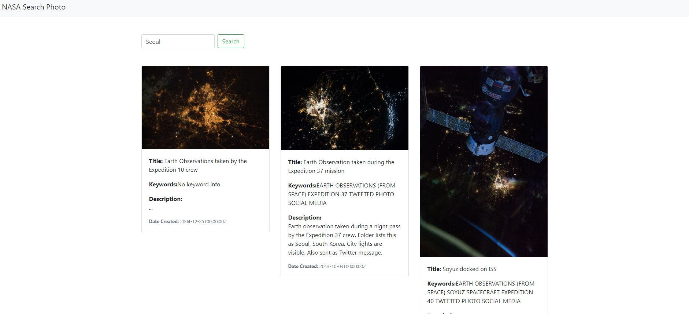

# NASA Search Photo SPA


### 🎺 소개


본 웹 어플리케이션은 리엑트 프레임워크를 사용하여 개발하였습니다. 사용자가 검색창에 입력한 값을 images.nasa.gov API(v1.5.3 019­04­18)에서 조회하여 카드 형태로 보여줍니다. 


### 💻 Tech

#### [1] 비동기 처리(axios)
 - Angular는  HTTP Client 를 내장하고있지만 React는 내장하고 있지 않습니다. 
 - React에서 AJAX 를 구현하려면 JavaScript 내장객체인 XMLRequest 를 사용하거나, 다른 HTTP Client 라이브러리르 사용해야합니다.
- componentDidMount vs useEffect 
    - NASA API 호출은 `NasaData.js`의 useEffect에서합니다. 
    - useEffect는 컴포넌트가 render를 마친 다음에 실행됩니다.
    - useEffect는 rendering될 때(혹은 url이 바뀔 때)마다 실행됩니다.

- 이벤트를 전파하지 않고 취소

``` javascript
setText = (e) => {
    e.preventDefault();  // 기본적인 submit 행동을 취소
    this.setState({text: e.target.value}); // submit후 액션
```


#### [2] API 호출

#### [3] react-clamp-lines
- [NPM DOCUMENT. react-clamp-lines](https://www.npmjs.com/package/react-clamp-lines)


### ✅ TODO 

#### 페이지네이션
- 참고. [Simple Frontend Pagination | React (Youtube)](https://www.youtube.com/watch?v=IYCa1F-OWmk)

``` javascript
class NasaData extends React.Component {
    constructor(props) {
        this.state = {
            setLoading: false,
            currentPage: 1,
            setCurrentPage: 1,
            postsPerPage: 2,
            ...

render() {
    this.indexOfLastPost = this.state.currentPage * this.state.postsPerPage;
    this.indexOfFirstPost = this.indexOfLastPost - this.state.postsPerPage;
    this.currentPosts = this.state.nasaData.collection.items.slice(this.state.indexOfFirstPost, this.state.indexOfLastPost);
    ...
```


### 🌹 디자인
- 앨범 스타일 디자인 참고
	- [Bootstrap 4 Album example by Benjamin Berglund](https://codepen.io/WeeHorse/pen/PQydzW)
- 로딩창 디자인
	- [W3School](https://www.w3schools.com/howto/howto_css_loader.asp)


### 🚀 실행

`create-react-app`을 사용하여 만들어져 있으며 `npm install` 후 `npm start` 하여 실행합니다.

``` bash
npm start
```
